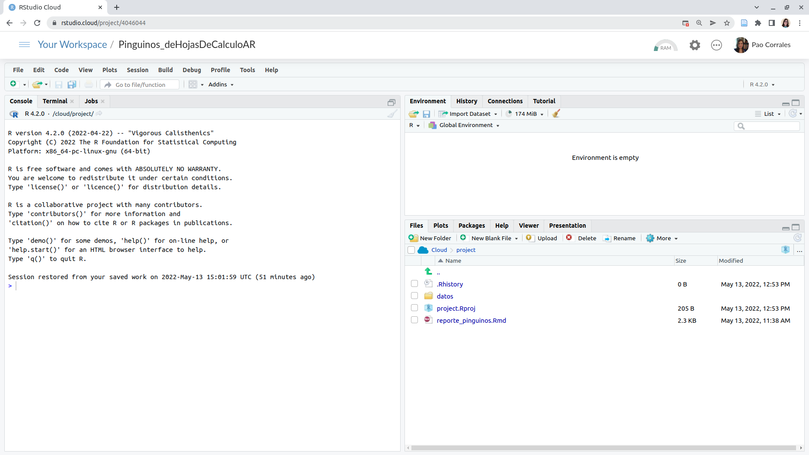

## ¿Por qué R?

Las hojas de cálculo son un software admirable. Son geniales para cargar datos, para ver los datos crudos y para hacer gráficos rápidos. Si venís usándolo hace tiempo, seguro que aprendiste un montón de trucos para sacarle el jugo al máximo, habrás aprendido a usar fórmulas, tablas dinámicas, e incluso macros. Pero seguro que también sufriste sus limitaciones.

En una hoja de cálculo no hay un límite claro entre datos y análisis. Sobrescribir datos es un peligro muy real y análisis complicados son imposibles de entender, especialmente si abrís una hoja de cálculo armada por otra persona (que quizás es tu vos del pasado). Además, repetir el análisis en datos distintos o cambiando algún parámetro se puede volver muy engorroso.

Si lo que necesitás son reportes frecuentes y automáticos, y análisis de datos con muchas partes móviles, estaría bueno poder escribir una receta paso a paso y que la computadora corra todo automáticamente cada vez que se lo pedís. Para poder hacer eso, ese paso a paso tiene que estar escrito en un lenguaje que la computadora pueda entender, ese lenguaje es R.

## ¿Cómo vamos a trabajar?

Vamos a usar R como lenguaje de programación y RStudio como una IDE (Integrated Development Environment), un Entorno Integrado de Desarrollo. Si no los tenés instalado en tu computadora, no te preocupes, tenemos este  [proyecto en RStudio Cloud](https://rstudio.cloud/project/3174865) para que puedas trabajar.

Para iniciar RStudio, hacé doble click en el ícono de RStudio. Iniciar  RStudio también inicia R (en realidad, es probable que nunca abras R por sí mismo).




Observa los paneles por defecto:

  * Consola (toda la izquierda)
  * Environment/History (pestaña en la parte superior derech)
  * Files/Plots/Packages/Help (con pestañas en la parte inferior derecha)

No es necesario que sepamos utilizar todo esto de inmediato. Nos familiarizaremos con más opciones y capacidades a lo largo del taller.

Podemos escribir código, es decir, instrucciones para ser ejecutadas por R en la Consola. Por ejemplo, podemos calcular el resultado dos más dos escribiendo

```{r}
2 + 2
```

en la Consola y pulsando enter. 

El resultado aparece justo debajo. También podemos guardar ese resultado en un objeto, en este caso llamado `x`.

```{r}
x <- 2 + 2 
```

Esa flechita es el *operador de asignación* y funciona como un `=`. Ahora el resultado se guarda en el Entorno (Environment) como una variable con nombre `x` y no se imprime en la consola. 

Esto es útil cuando estamos probando el código para ver si funciona pero lo perderemos todo cuando cerremos RStudio. Lo que tenemos que hacer es guardar el código que genera su análisis. Para ello utilizamos R Scripts y archivos RMarkdown.

Vamos a tener nuestra primera experiencia con R a través de RMarkdown, así que vamos a ver qué es un documento RMarkdown. Te preparamos [este informe de ejemplo](penguins_report.Rmd), por favor abrilo en RStudio o en RStudio Cloud. El archivo aparecerá en un nuevo panel arriba en el lado izquierdo de la pantalla, y el panel de la consola se moverá hacia abajo.


## RMarkdown

Un archivo RMarkdown es un archivo de texto plano, con algunas reglas y una sintaxis especial que nos permite escribir código y texto juntos. Cuando se "teje" (knit), el código se evaluará y ejecutará y el texto se formateará de manera que se cree un informe o documento reproducible que sea agradable de leer y que contenga todo tu trabajo.

Esto es realmente crítico para la reproducibilidad. También nos ahorra tiempo y puede ayudar en las tareas de automatización. Este documento recreará tus figuras por ti en el mismo documento donde estás escribiendo el texto que las explica. Esto le ahorrará el esfuerzo de hacer un análisis, guardar un gráfico en un archivo, copiar y pegar ese gráfico en Word o Power Point o Google Slides, y tener que hacerlo todo de nuevo después de descubrir un error tipográfico.

Ahora veamos cómo es nuestro Informe de Pingüinos.

* La parte superior tiene el Título y el tipo de salida (que en este caso es un documento HTML).
* Debajo hay secciones alternas _blancas_ y _grises_. Estas son las dos secciones principales que componen un archivo RMarkdown:
      * Las secciones grises son el código R
      * Las secciones blancas son el texto de Markdown
* Hay texto negro, azul y verde.

> Sigamos adelante y "tejamos (knit)" el documento haciendo clic en el ovillo de hilo azul () en la parte superior del archivo RMarkdown. 

¡Acabamos de crear un archivo html! Se trata de una única página web que estamos viendo localmente en nuestros propios ordenadores. Al generar este documento RMarkdown, R ha formateado el texto markdown y ha ejecutado el código R.


### Texto markdown

Podes ver una guia sobre rmakdown [en esta guía rápida](https://raw.githubusercontent.com/rstudio/cheatsheets/main/translations/spanish/rmarkdown_es.pdf), pero aquí hay una sintaxis mínima para empezar:

* encabezados empiezan con `# ` o `## `y asi siguiendo (es importante poner un espacio después del último `#`).
* las palabras en negrita están rodeadas de `**`
* y las cursiva, con `_`

### Código de R

```{r include=FALSE}
chunk_start <- "```{r label}"
chunk_end <- "```"
```

El código R se escribe dentro de "chunks (trozos)" de código. Los trozos de código comienzan con `` `r chunk_start` `` (donde "label" es un nombre opcional y único) y terminan con `` `r chunk_end` ``. En RStudio, podes crear un nuevo chunk con el atajo de teclado `Ctrl + Alt + I`.

Este informe muestra información sobre los pingüinos Papúa, pero podríamos cambiar algunas líneas de código para crear el mismo análisis para las otras dos especies, Adelia y Barbijo.

> Ahora es tu turno. Sigue buscando en el código, si encuentras alguna mención a "Papúa", cámbiala por cualquiera de las otras especies. 

Esta tarea es un poco engorrosa si hay que cambiar muchas cosas cada vez que queremos volver a ejecutar el análisis para diferentes especies. Pero no te preocupes, aprenderemos a hacer todo más automático al final del taller. 

