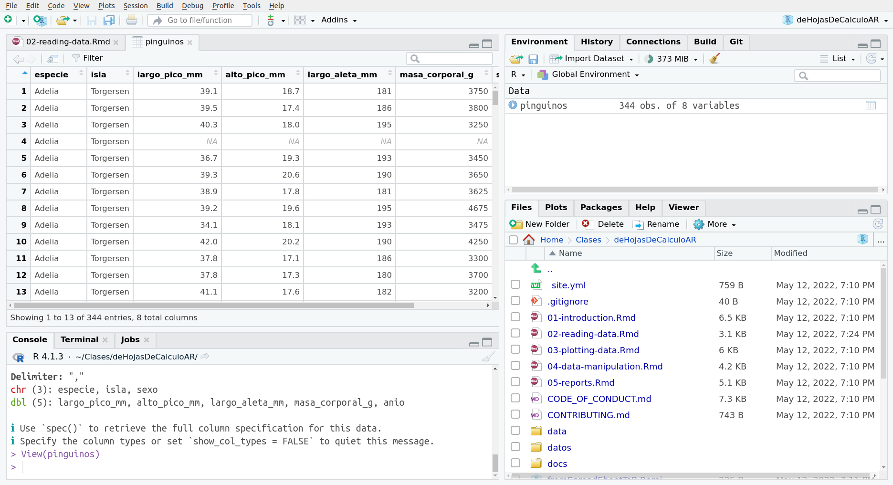

```{r setup, include=FALSE}
knitr::opts_chunk$set(echo = TRUE)
```

## Sobre los Pingüinos de Palmer

Es hora de presentar el conjunto de datos que estamos utilizando. Los datos de **Pingüinos de Palmer** fueron recogidos y puestos a disposición por la Dra. Kristen Gorman y la [Estación Palmer en la Antártida, LTER](https://pal.lternet.edu/), que es parte de la Red de Investigación Ecológica a Largo Plazo. El conjunto de datos incluye varias características de los pingüinos Adelia, Barbijo y Papúa. Puedes leer más sobre ello en la [documentación de palmerpenguins](https://allisonhorst.github.io/palmerpenguins/). 

Estos datos están disponibles en R instalando el paquete palmerpenguins (en inglés) o el paquete datos (en español), pero como queremos aprender a leer datos en R, vamos a leerlos desde archivos csv y xls.

## Leyendo archivos csv

Empezaremos cargando el paquete **tidyverse**, que nos da acceso a docenas de paquetes y funciones con las que trabajar. Por ahora usaremos la función `read_csv()` para leer un archivo .csv que está almacenado en el directorio de datos. 

```{r}
library(tidyverse)

pinguinos <- read_csv("datos/pinguinos.csv")
```

En Excel o Google Sheets, los datos se almacenan en la hoja de cálculo y se organizan en celdas. En R, se almacenan en objetos. Cuando leemos un archivo csv, los datos van directo a un data.frame llamado `pinguinos` y están listos para ser utilizados. En la solapa "Environment" podemos ver el objeto `pinguinos`, y si hacemos clic en ese objeto los datos se abrirán en una nueva pestaña para que veamos que pinta tiene. 




Esta previsualización es lo más parecida a la que tenemos en una hoja de cálculo. Podemos llegar a este panel ejecutando `View(pinguinos)` en la consola. Hay otras funciones que nos sirven para visualizar nuestros datos.  Vamos a utilizar una de ellas:

```{r}
glimpse(pinguinos)
```

Esta salida es diferente y nos da información sobre el tipo de datos en cada columna (o variable).

A veces nuestros datos no son tan amigables y necesitamos dar más información a la función para poder leer los datos correctamente. Puedes encontrar estas opciones buscando en la documentación de la función. 

> Escribe `?read_csv()` en la consola y revisa la documentación. ¿Cómo se llama la opción para cambiar el delimitador por defecto?

## Leyendo archivos xlsx

¿Cómo podemos trabajar con archivos xlsx? Necesitaremos otro paquete de R, **readxl** que ya está instalado en el proyecto RStudio Cloud, solo necesitamos cargar la librería. En este caso la función se llama `read_excel()`.

```{r}
library(readxl)

penguinos_xls <- read_excel("datos/pinguinos.xlsx")
```

Y listo, hemos leído un archivo xlsx. Por supuesto, a veces tenemos que trabajar con archivos con múltiples hojas o con datos que no están muy organizados. Esta función viene con varias opciones o argumentos para leer hojas específicas (`sheet = <nombre de la hoja>`) o un rango específico (`range` = "C1:E7"`) y otros. 

Ahora que tenemos los datos leídos en R, es el momento de analizar esos datos. 

