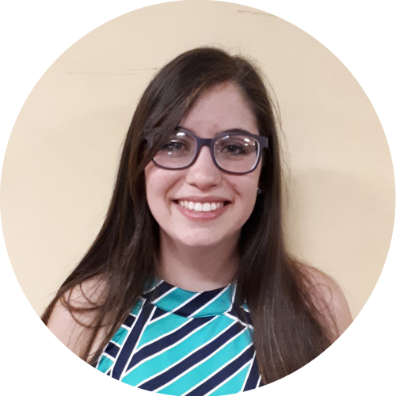

### De que se trata este curso?

Este curso está dirigido a [personas](personas.html) que utilizan hojas de cálculo para la manipulación de datos y que nunca han programado, pero que les gustaría aprender a trabajar con R. Por lo tanto, comenzamos por el principio: ¿por qué usar R? y ¿por dónde empezar?

Proponemos trabajar con R de forma ordenada y reproducible. Por ello, presentamos un flujo de trabajo que permite a quienes realicen este curso aplicar buenas prácticas de programación, trabajar de forma colaborativa y presentar su trabajo en un único documento que incluya el análisis y los resultados.

Siempre que podamos, mencionaremos cómo lo que proponemos resolver con R también se puede hacer con hojas de cálculo y las ventajas y desventajas de cada enfoque.

En cada sección incluimos actividades junto con ejemplos. Queremos que estos ejercicios sean realistas para que cualquiera pueda encontrar similitudes en sus propios datos y pueda aplicar lo aprendido a otras situaciones.

### Antes de comenzar

Durante este taller utilizaremos RStudio Cloud. Si quieres trabajar localmente en tu computadora usaremos R y RStudio. Por favor, [sigue estas instrucciones para prepararte antes del taller](prepare.html).

### Agenda

Este es un cronograma tentativo. 

|Duración |Temas|
|:---|:----------|
|55 minutos | [Introduccion, reportes, flujo de trabajo](01-introduction.html) |
|5 minutos | Pausa |
|55 minutos | [Leyendo](02-reading-data.html) y [Graficando](03-plotting-data.html) datos |
|5  minutos | Pausa |
|30 minutos | [Manipulación de datos](04-data-manipulation.html) |
|20 minutos | [Comunicando tu trabajo](05-reports.html) |
|10 minutos | Preguntas y cierre |

### ¿Quienes somos? 

**Yanina Bellini Saibene**

Yanina Bellini Saibene. Es investigadora en el Instituto Nacional de Tecnología Agropecuaria (INTA, Argentina). Aplica sus conocimientos de informática y ciencia de datos para llevar los desarrollos tecnológicos a las regiones rurales y desatendidas de Argentina. También desarrolla software para apoyar la investigación y la educación. Es profesora de grado y posgrado en varias universidades de Argentina y Uruguay, enseñando Ciencia de Datos aplicada y desarrollando cursos abiertos y tutoriales para enseñar habilidades técnicas en el manejo de datos. Es formadora, instructora y miembro del Executive Council de [The Carpentries](https://carpentries.org/) e instructora certificada de [RStudio](https://education.rstudio.com/trainers/people/bellini_saibene+yanina/). Ha formado a profesores desde 1996 a través de la Red Federal de Formación Docente Continua (Ministerio de Educación de la Nación, Argentina). Es cofundadora de [MetaDocencia](http://metadocencia.org/). Forma parte del equipo de R-Ladies Global. También lidera y participa en la traducción comunitaria de material educativo y técnico al español, como Teaching Tech Together, R4DS, y The Carpentries Lessons. 

[yabellini.netlify.com](https://yabellini.netlify.com/)

**Pao Corrales**

 Paola Corrales. Es estudiante de doctorado en la Universidad de Buenos Aires. Estudia ciencias de la atmósfera aplicando técnicas de asimilación de datos para mejorar los pronósticos a corto plazo de eventos severos en Argentina. Es trainer e instructora de [The Carpentries](https://carpentries.org/) e instructora certificada de [RStudio](https://education.rstudio.com/trainers/people/corrales+paola/). También ha contribuido a proyectos de traducción de materiales de The Carpentries y al libro Teaching Tech Together. Forma parte de Expedición Ciencia, una organización sin ánimo de lucro con sede en Argentina, donde dirige proyectos educativos como campamentos y talleres de ciencia para estudiantes y profesores de ciencias de primaria y secundaria. Es profesora de la Licenciatura y la diplomatura en Ciencias de Datos de la Universidad Guillermo Brown.  Es cofundadora de [MetaDocencia](http://metadocencia.org/). También desarrolla materiales de licencia abierta para enseñar y aprender R desde cero. 

[paobcorrales.github.io](https://github.com/paocorrales) | [\@paobcorrales](https://twitter.com/PaobCorrales)

 Yani y Pao forman parte de MetaDocencia, una organización sin fines de lucro que nutre a una comunidad de educadores y educadoras de habla hispana mediante la enseñanza de métodos educativos concretos, basados en la evidencia y centrados en los y las estudiantes. MetaDocencia desarrolla en colaboración recursos abiertos, reutilizables y accesibles para fomentar prácticas de formación eficaces.

[MetaDocencia.org](https://www.metadocencia.org/)

___

#### Licencia

 
Todos los materiales de este curso en encuentra bajo la licencia <a rel="license" href="https://creativecommons.org/licenses/by-sa/4.0/deed.es_ES">Creative Commons Attribution-ShareAlike 4.0 International License</a>.

Nos inspiramos y nos basamos en los siguientes recursos:

* [R for Reproducible Scientific Analysis](https://swcarpentry.github.io/r-novice-gapminder/) por The Carpentries

* [R for Excel Users](https://rstudio-conf-2020.github.io/r-for-excel/) por Dr. Julie Stewart Lowndes and Dr. Allison Horst

* [R for Data Science](https://r4ds.had.co.nz/) por Hadley Wickham

* [de Excel a R](https://paocorrales.github.io/deExcelaR/) por Paola Corrales y Elio Campitelli

* [An Antarctic Tour of the Tidyverse](https://silvia.rbind.io/talk/2020-08-31-tour-of-the-tidyverse/) por Silvia Canelón

El código fuente de estos materiales y la página web pueden encontrarse en https://github.com/yabellini/deHojasDeCalculoAR.
